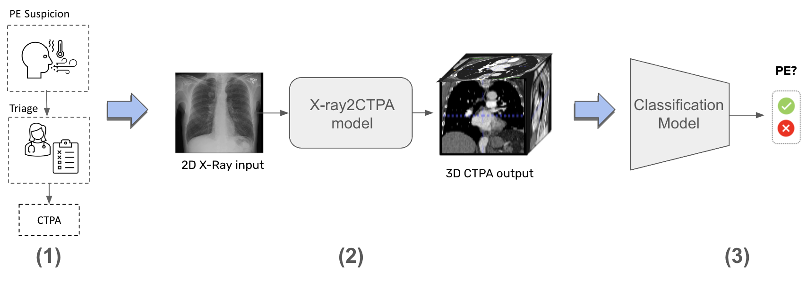
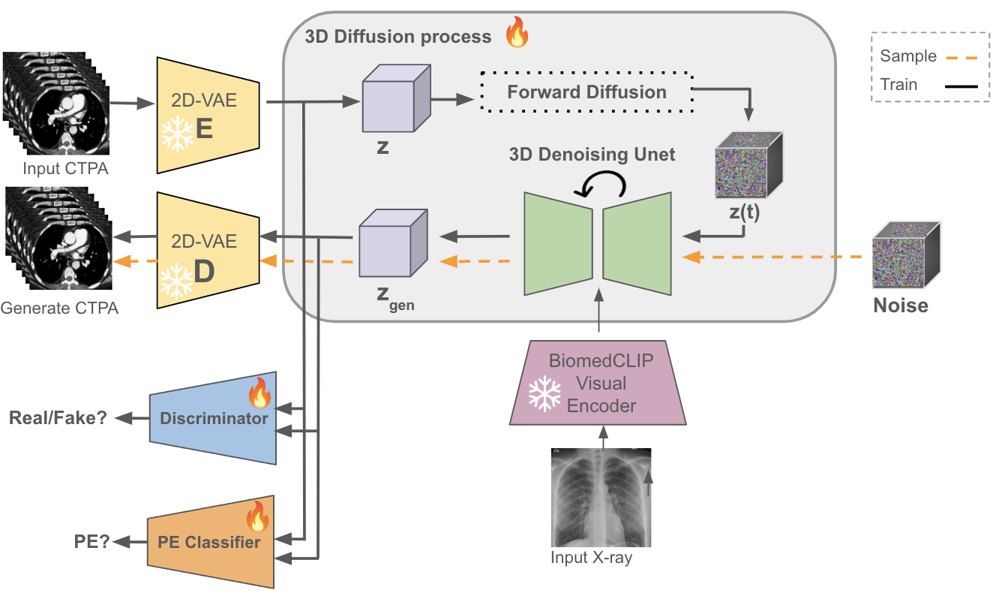
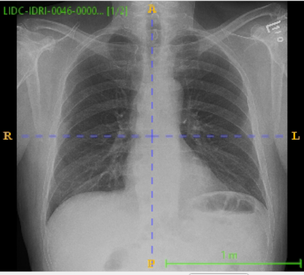
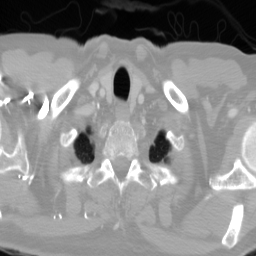

# X-ray2CTPA

This repository contains the scripts and models used in the paper *"X-ray2CTPA: Generating 3D CTPA scans from 2D X-ray conditioning"*.

# Introduction

X-ray imaging, commonly used for medical diagnostics, typically offers lower resolution compared to CT scans, which offer more detailed and accurate three-dimensional views, particularly those enhanced with contrast agents like CT Pulmonary Angiography (CTPA). However, CT scans entail higher costs, greater radiation exposure, and are less accessible than X-rays. 
In this work we explore cross-modal translation from a 2D low resolution X-ray input to a 3D high resolution CTPA scan. Driven by recent advances in generative AI, we introduce a novel diffusion-based approach to this task. We evaluate the model's performance using both quantitative metrics and qualitative feedback from radiologists, ensuring diagnostic relevance of the generated images. 
Furthermore, employing our synthesized 3D images in a classification framework shows promise in improving diagnostic accuracy. The proposed method is generalizable and capable of performing additional cross-modality translations in medical imaging. It may pave the way for more accessible and cost-effective advanced diagnostic tools.
The outline and study design used for this research is depicted: 
 

Our suggested model is presented below:



# Results

We present both a generated 3D CTPA and CT scans from our CTPA and LIDC datasets respectively. They are presented along with their ground truth corresponding 3D scan and 2D X-ray inputs.

<table>
  <tr>
     <td>
      
      <br>
      <p align="center">2D X-ray input</p>
    </td>
    <td>
      
      <br>
      <p align="center">Ground Truth 3D CTPA</p>
    </td>
    <td>
      
      <br>
      <p align="center">Generated 3D CTPA</p>
    </td>
  </tr>
  <tr>
     <td>
      
      <br>
      <p align="center">2D X-ray input</p>
    </td>
    <td>
      
      <br>
      <p align="center">Ground Truth 3D CT</p>
    </td>
    <td>
      
      <br>
      <p align="center">Generated 3D CT</p>
    </td>
  </tr>
</table>

We compare the average AUC scores (with a 95% confidence interval) of the PE classification from X-ray and CTPA only baselines and the Generated CTPAs on our test set. 

|    Model                       |       AUC       | Accuracy | Specificity | Sensitivity  |
|--------------------------------|-----------------|----------|-------------|--------------|
|CTPA only classifier            |0.83 [0.75-0.92] | 0.77     | 0.78        |   0.74       |
|X-ray only classifier           |0.69 [0.54-0.77] | 0.71     | 0.70        |   0.73       |
|Generated CTPA only classifier  |0.76 [0.7-0.89]  | 0.73     | 0.73        |   0.74       |


# Setup
In order to run our model, download and install the required libraries by running: 
```
pip install -r requirements.txt
```

# Training
Once all libraries are installed and the datasets have been downloaded, you are ready to train the model:

To train the diffusion model, you need to run the following command
```
python train/train_ddpm.py model=ddpm dataset=xrayctpa model.vae_ckpt='stabilityai/stable-diffusion-xl-base-1.0' model.results_folder_postfix='lora_finetune' model.vqgan_ckpt=<INSERT_PATH_TO_CHECKPOINT> model.diffusion_img_size=32 model.diffusion_depth_size=64 model.diffusion_num_channels=4 model.dim_mults=[1,2,4,8] model.batch_size=10 model.gpus=1
```
Where you again need to specify whether you would like to run the model using a 2D-VAE of a 3D-VQGAN and the path to the checkpoint (e.g. ```model.vae_ckpt='stabilityai/stable-diffusion-xl-base-1.0''```)

# Train on your own dataset
To simpify the dataloading for your own dataset, we provide a default dataset that simply requires the path to the folder with your NifTI images inside, i.e.

    root_dir/					# Path to the folder that contains the images
    ├── img1.nii                # The name of the NifTI file is not important
    ├── img2.nii                    
    ├── img3.nii                     
    ├── ...                    

All you need to do now is just specify the path to this root directory the way we have dealt with it before. Note that you need to provide the path to the dataset (e.g. ```dataset.root_dir='/../../root_dir/'```) to successfully run the command.

# Acknowledgement
This code is heavily build on the following repositories:

(1) https://github.com/FirasGit/medicaldiffusion

(2) https://github.com/SongweiGe/TATS

(3) https://github.com/lucidrains/denoising-diffusion-pytorch

(4) https://github.com/lucidrains/video-diffusion-pytorch

## Citation
If you use any of our code, please cite our paper.

